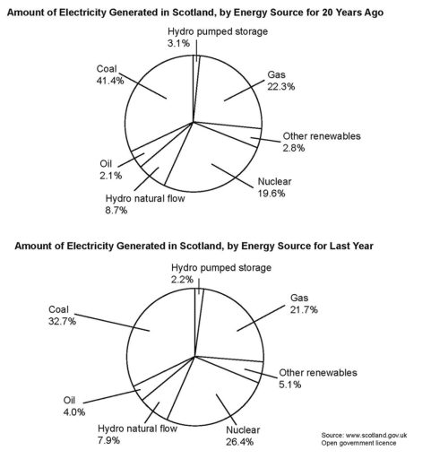

# Alternative Introduction
- The two pie charts illustrates generation of electricity through various sources in Scotland for 20 years ago and previous year.
- The two pie charts illustrates proportion of sources of electricity generated in Scotland for two decades ago and previous year.

# Initial
> 164 words, 10 sentences
- The two pie charts illustrates proportion of production of electricity from various sources in Scotland from two decades ago and previous year.
- Overall, Coal remained the largest source of energy. Significant growth is seen in production of Nuclear energy. A slight improvement is shown by some other renewables source. Other ways of production of electricity through Gas, Hydro pumped storage, Oil and Hydro natural flow shows almost no deviation.
- In previous year, Coal shown a slight reduction in production of electricity generation that is from a little below of half to almost one third. While, Nuclear went from being a fifth to a quarter proportion. In addition, Gas, Hydro natural flow and Hydro pumped storage shown a little negative deviation, from 8.7% to 7.9%, 22.3% to 21.7% and 3.1% to 2.2% respectively. However, Oil, a non-renewable source, depict a positive deviation from 2.2% to a whole four percent. Other renewable sources also shown increasing proportion i.e from 2.8% to 5.1%.

# Adding more transitions + 4 paragraphs
> 226 words, 13 sentences
- The two pie charts illustrates proportion of production of electricity from various sources in Scotland from two decades ago and previous year.
- Overall, Coal remained the largest source of energy, although it shares declined significantly. In contrast, significant growth is seen in production of Nuclear energy & other renewables source, while Gas, Hydro pumped storage, Oil and Hydro natural flow shown almost no deviation.
- Two decade ago, coal accounted for the highest proportion of electricity production at 41.4%. Gas & Nuclear, being the second & third largest, shown nearly a fifth of whole. While, Hydro natural flow, hydro pumped storage and other renewables marginaly contributed at 8.7%, 3.1% and 2.8% respectively,. The smallest impact is made by Oil at 2.1%.
- In previous year, Coal still made the largest impact but fell significantly to a little less than one-third. Similarly, Gas and Hydro natural flow shown a slight negative deviation, from 8.7% to 7.9% and 22.3% to 21.7% respectively. While, Nuclear, still being second largest, went from being a fifth to a quarter proportion. In addition, Oil, a non-renewable source, depicted a positive deviation at a whole four percent. Also, Other renewable sources also shown increasing proportion i.e from 2.8% to 5.1%. In contrast to oil stats of 20 years ago, This time Hydro pumped storage being the least share, at just 2.2%.
---
